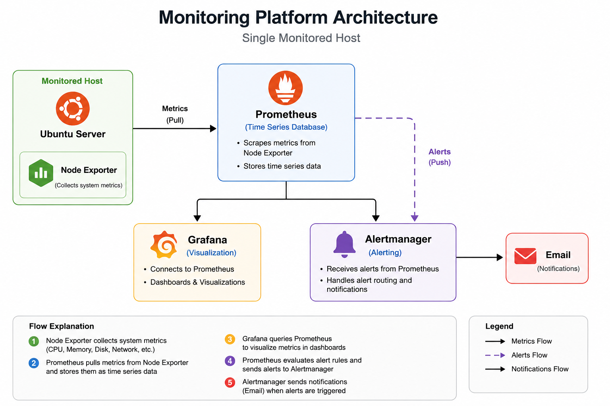
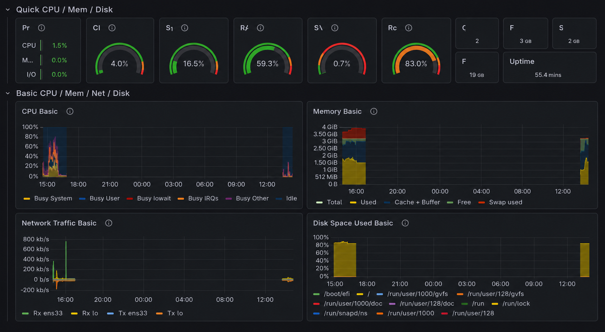
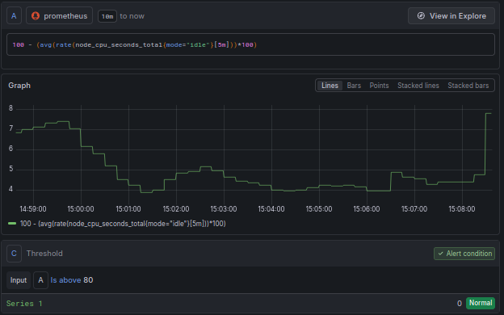
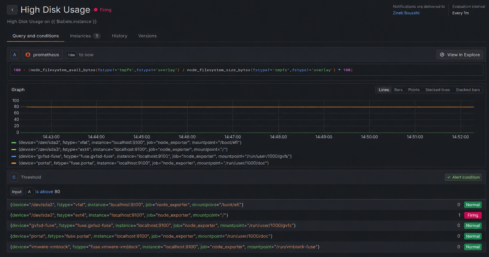
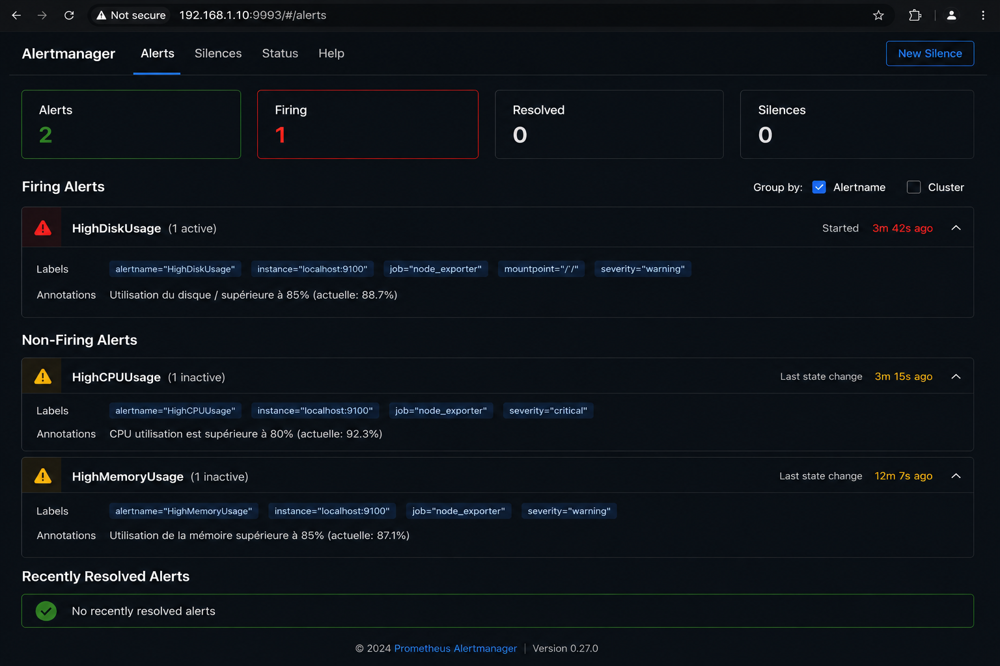

#  Plateforme de Monitoring et d’Observabilité

Plateforme de supervision développée sous Linux avec **Prometheus**, **Grafana**, **Alertmanager** et **Node Exporter** pour la collecte des métriques système, la visualisation en temps réel et la génération d’alertes automatiques.

##  Technologies utilisées

* Linux (Ubuntu)
* Docker & Docker Compose
* Prometheus
* Grafana
* Alertmanager
* Node Exporter

---

##  Architecture de la solution

---

##  Tableau de bord Grafana

Visualisation en temps réel des ressources système :

* Utilisation CPU
* Utilisation Mémoire
* Utilisation Disque
* Trafic Réseau

---

##  Système d'alertes

### Alerte CPU élevé

Déclenchée lorsque l'utilisation du processeur dépasse le seuil défini.

### Alerte espace disque élevé

Déclenchée lorsque l'utilisation du disque dépasse le seuil critique.

### Gestion des alertes avec Alertmanager

##  Fonctionnalités

* Supervision en temps réel
* Collecte automatique des métriques système
* Visualisation via Grafana
* Gestion des alertes avec Alertmanager
* Notifications automatiques par e-mail
* Surveillance des ressources critiques

---

##  Compétences démontrées

* Administration Linux
* Docker
* Monitoring & Observabilité
* Prometheus
* Grafana
* Alertmanager
* Supervision d'infrastructure
* Analyse des performances système
